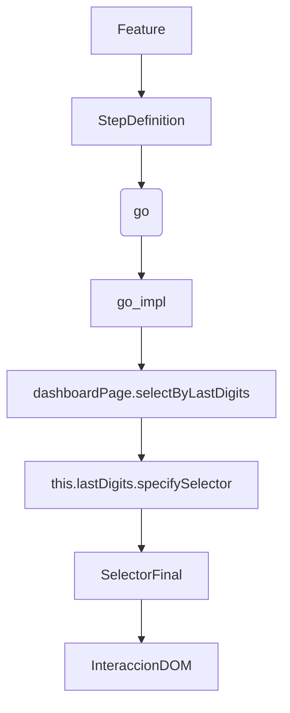

## 1. **Contexto y carga del objeto `user`**

- El valor `"always on transfers"` del feature se usa como tag/criterio.
- El sistema de test (por ejemplo, Cucumber + DataManager) hace una petición (simulada o real) que retorna los datos del usuario, como en el YAML adjunto.
- El objeto `user` se llena dinámicamente con la respuesta, y queda disponible en el contexto global del test.
- Así, los steps pueden acceder a `user.products`, `user.products[0].accounts`, etc.

---

## 2. **Navegación: `go` y `go_impl`**

- En el archivo `productDetail.js` tienes:
  ```js
  class ProductDetail extends AbstractGlomoNavigation {
      // ...
      async go_impl({account} = {}) {
          switch (currentPage.getId()) {
              case DASHBOARD:
                  await Commands.pause({time: config.wait.S});
                  await dashboardPage.selectByLastDigits(account);
                  break;
              // ...
          }
      }
  }
  ```
- **¿Dónde está el método `go`?**
  - No aparece en la subclase, pero por el patrón, está en la clase base `AbstractGlomoNavigation`.
  - El método `go` de la clase base llama internamente a `go_impl` de la subclase, permitiendo que cada página defina su propia lógica de navegación.
  - Este patrón es común en frameworks de automatización para desacoplar la lógica genérica de la específica.

---

## 3. **Elementos y selectores: `this.lastDigits`, `this.numberAccount`, `this.numberProduct`**

- En el constructor de la clase `Dashboard` (y otras páginas), se definen los elementos como propiedades del objeto:
  ```js
  class Dashboard extends AbstractGlomoPage {
      constructor() {
          super({
              root: '#cells-template-dashboard[state="active"]',
              name: 'dashboard',
              elements: {
                  lastDigits: 'cells-product-item[data-selector*="__LAST_DIGITS__"i]',
                  numberAccount: '[data-tag-name="app-info-structure-home-dashboard-product-basic"] [text="__LAST_DIGITS__"]',
                  numberProduct: 'app-info-structure-home-core [data-tag-name="app-info-structure-home-dashboard-product-container"] [number="__LAST_DIGITS__"]',
                  // ... muchos más
              }
          });
      }
      // ...
  }
  ```
- **¿Qué son estas propiedades?**
  - Son strings que representan selectores CSS con placeholders.
  - Al pasar estos elementos al constructor de la clase base (`AbstractGlomoPage`), el framework los convierte en objetos que tienen métodos como `specifySelector`.
  - Así, puedes hacer:
    ```js
    const element = this.lastDigits.specifySelector({placeholder: '__LAST_DIGITS__', value: accountName});
    ```
    y el método reemplaza el placeholder por el valor real, devolviendo el selector final.

---

## 4. **¿Dónde está implementado `specifySelector`?**

- No está en el código fuente del proyecto, sino en el framework `@csqe/radish` (que no tienes en tu workspace).
- El framework toma los strings de los elementos y los convierte en objetos con métodos para interactuar con el DOM, como `specifySelector`, `click`, `waitForDisplayed`, etc.
- **Conclusión:** Los elementos como `this.lastDigits` son instancias de una clase interna del framework que implementa `specifySelector`.

---

## 5. **Flujo completo de navegación y selección**

1. El test define el usuario y el contexto.
2. Se navega usando `navigation.account.productDetail.go({account})`.
3. El método `go` de la clase base llama a `go_impl` de la subclase.
4. En `go_impl`, se llama a `dashboardPage.selectByLastDigits(account)`.
5. En ese método, se usa un elemento como `this.lastDigits`, que es un selector parametrizable.
6. Se llama a `specifySelector` para obtener el selector final y se interactúa con el elemento (click, validación, etc.).

---

## 6. **Depuración de errores de selectores**

- Si el valor que se pasa al placeholder no coincide con el renderizado, el elemento no se encuentra y el test falla.
- Para depurar:
  1. Verifica el valor que se está usando para el placeholder (`accountName`).
  2. Compara el selector generado con el HTML real renderizado.
  3. Ajusta el valor o el selector para que coincidan.

---

## 7. **Puntos extra para el análisis y depuración**

- **Revisa los datos del usuario:** Asegúrate que los datos en el YAML y en el objeto `user` coincidan con lo que esperas en el test.
- **Revisa los selectores:** Si el HTML cambia, actualiza los selectores en los elementos del constructor.
- **Revisa el framework:** Si tienes acceso al código de `@csqe/radish`, revisa cómo convierte los strings en objetos y cómo implementa `specifySelector`.
- **Revisa los logs:** Los logs que muestras son útiles para ver exactamente qué selector se está generando y qué valor se está usando.

---

## 8. **Resumen visual del flujo**



---

## 9. **¿Qué hacer si el selector no coincide?**

- Verifica el valor que se está usando para el placeholder.
- Compara con el HTML real.
- Ajusta el valor en el test o el selector en el elemento.

---

**En resumen:**  
El flujo está altamente desacoplado y parametrizado, lo que permite flexibilidad pero requiere atención a los datos y los selectores. El framework convierte los strings en objetos interactivos, y la navegación se maneja por herencia y polimorfismo.

¿Te gustaría que busque la definición exacta de la clase base `AbstractGlomoNavigation` y el método `go` para mostrarte el patrón completo? ¿O necesitas ejemplos de cómo ajustar los selectores para que coincidan con el HTML?
