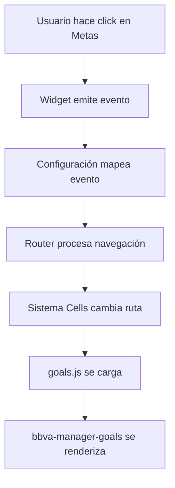

# Tutorial: Navegación de Componentes en GloMo - Arquitectura Cells

## Índice
1. [Introducción a la Arquitectura](#introducción-a-la-arquitectura)
2. [Conceptos Clave](#conceptos-clave)
3. [Flujo Completo de Navegación](#flujo-completo-de-navegación)
4. [Implementación Paso a Paso](#implementación-paso-a-paso)
5. [Debugging y Troubleshooting](#debugging-y-troubleshooting)
6. [Mejores Prácticas](#mejores-prácticas)

---

## Introducción a la Arquitectura

### ¿Qué es Cells?
**Cells** es un framework basado en Web Components que permite crear aplicaciones modulares y reutilizables. En GloMo, cada página está compuesta por múltiples componentes que se comunican entre sí mediante eventos.

### Arquitectura de Capas

```
┌─────────────────────────────────────────────────────┐
│                   CAPA DE UI                        │
│  (Widgets: app-info-structure-home-main-card)       │
└─────────────────────────────────────────────────────┘
                        ↓ Eventos
┌─────────────────────────────────────────────────────┐
│              CAPA DE CONFIGURACIÓN                  │
│  (Mapeo de eventos a acciones: _operationals.js)   │
└─────────────────────────────────────────────────────┘
                        ↓ Datos
┌─────────────────────────────────────────────────────┐
│                CAPA DE ROUTING                      │
│  (Router: bbva-technicalcore-global-feature-id...)  │
└─────────────────────────────────────────────────────┘
                        ↓ Navegación
┌─────────────────────────────────────────────────────┐
│              CAPA DE DESTINO                        │
│  (Página: goals.js con bbva-manager-goals)          │
└─────────────────────────────────────────────────────┘
```

---

## Conceptos Clave

### 1. Widget
**¿Qué es?** Un componente web reutilizable que encapsula funcionalidad específica.

**Características:**
- Viven en `@bbva-web-components-widgets/`
- Son independientes y reutilizables
- Se comunican mediante eventos personalizados (Custom Events)
- Ejemplo: `app-info-structure-home-main-card`, `metas-saving-goals`

**¿Por qué?** Permite separar la UI de la lógica de negocio y reutilizar componentes en diferentes contextos.

### 2. CellsConnections
**¿Qué es?** Sistema de comunicación entre componentes mediante eventos.

**Estructura:**
```javascript
cellsConnections: {
  in: {    // Eventos que el componente ESCUCHA
    evento_entrante: {
      bind: 'nombre-del-evento-dom'
    }
  },
  out: {   // Eventos que el componente EMITE
    evento_saliente: {
      bind: 'nombre-del-evento-dom',
      link: { page: 'destino' }  // Opcional: navegación
    }
  },
  params: { // Parámetros que se pasan automáticamente
    dashboardContractId: 'productId'
  }
}
```

**¿Por qué?** Desacopla componentes - un widget no necesita saber quién escucha sus eventos ni a dónde navega.

### 3. Template
**¿Qué es?** Define la estructura visual de una página.

**Responsabilidades:**
- Layout de la página (header, footer, áreas de contenido)
- Configuración de comportamiento (scroll, swipe)
- Ejemplo: `cells-template-coronita`

**¿Por qué?** Separa la estructura de la página del contenido, permitiendo reutilizar layouts.

### 4. Data Manager (DM)
**¿Qué es?** Componente que maneja la lógica de negocio y datos.

**Responsabilidades:**
- Llamadas a APIs
- Procesamiento de datos
- Coordinación entre widgets
- Ejemplo: `bbva-manager-goals`

**¿Por qué?** Separa la lógica de negocio de la presentación (patrón MVC).

---

## Flujo Completo de Navegación

### Caso de Uso: Navegar de Dashboard a Metas de Ahorro



### Flujo Técnico Detallado

```
1. Usuario click
   ↓
2. app-info-structure-home-main-card
   → Emite: 'app-info-structure-home-main-card-product-detail-click'
   → Detail: { productId: 'ME', internalId: 'ACCOUNTGOALS' }
   ↓
3. dashboard/_operationals.js
   → Busca configuración para 'ME'
   → Encuentra: createMainCardProductDetailConfig('ME', 'ACCOUNTGOALS')
   ↓
4. bbva-technicalcore-global-feature-id-router-mx
   → Recibe evento y configuración
   → Mapea ACCOUNTGOALS → goals (usando app-settings)
   → Emite: 'navigation_from_futura_dashboard'
   ↓
5. Sistema Cells
   → Intercepta evento de navegación
   → Cambia URL: #/goals
   → Pasa productId en contexto global
   ↓
6. goals.js
   → Se carga automáticamente
   → Escucha: 'navigation_from_futura_dashboard'
   → Carga componentes definidos
   ↓
7. bbva-manager-goals
   → Se renderiza en zone: 'app__main'
   → Recibe productId de params
   → Coordina widgets hijos
```

---

## Implementación Paso a Paso

### Paso 1: Widget - Emisión del Evento

**Archivo**: `@bbva-web-components-widgets/app-info-structure-home-main-card`

**¿Qué hace?** Muestra la lista de productos en el dashboard y maneja el click del usuario.

**¿Por qué aquí?** Es el punto de entrada de la interacción del usuario.

```javascript
// Archivo interno del widget (no modificas este, solo entiendes cómo funciona)

class AppInfoStructureHomeMainCard extends LitElement {
  
  /**
   * Maneja el click en un producto
   * @param {Object} productData - Datos del producto clickeado
   */
  _handleProductClick(productData) {
    // Emite un evento personalizado que "sube" por el DOM
    this.dispatchEvent(new CustomEvent('app-info-structure-home-main-card-product-detail-click', {
      bubbles: true,  // Permite que el evento "suba" por el árbol DOM
      composed: true, // Permite que cruce shadow DOM boundaries
      detail: {
        productId: productData.id,          // Ej: 'ME' (Metas)
        internalId: productData.internalId, // Ej: 'ACCOUNTGOALS'
        productType: productData.type,      // Ej: 'ACCOUNT'
        contractId: productData.contractId  // ID del contrato
      }
    }));
  }

  render() {
    return html`
      <div class="products-list">
        ${this.products.map(product => html`
          <button 
            @click="${() => this._handleProductClick(product)}"
            class="product-card">
            <h3>${product.name}</h3>
            <p>${product.balance}</p>
          </button>
        `)}
      </div>
    `;
  }
}
```

**Puntos clave:**
- `bubbles: true` es crucial - permite que otros componentes escuchen el evento
- El nombre del evento es importante - debe coincidir con la configuración
- `detail` contiene toda la información necesaria para la navegación

---

### Paso 2: Configuración de Productos

**Archivo**: `app/composerMocksTpl/dashboard/_operationals.js`

**¿Qué hace?** Define el mapeo entre productos y sus acciones de navegación.

**¿Por qué aquí?** Centraliza la configuración de operaciones, facilitando mantenimiento y escalabilidad.

```javascript
// app/composerMocksTpl/dashboard/_operationals.js

/**
 * Función base para crear configuraciones de productos
 * @param {string} productType - Tipo de producto (ACCOUNT, CARD, etc)
 * @returns {Function} Función que crea la configuración
 * 
 * ¿Por qué una función que retorna función?
 * → Permite reutilizar la lógica base y especializar por tipo
 */
const createProductConfig = productType => (productId, internalId, eventname) => ({
  productType,   // Tipo de producto para filtrado
  productId,     // ID único del producto (ME, CH, AH, etc)
  internalId,    // ID interno que mapea a la ruta
  eventname      // Nombre del evento que dispara esta configuración
});

/**
 * Función helper para configurar evento por defecto
 * @param {Function} createConfigFn - Función de configuración base
 * @param {string} defaultEventName - Evento por defecto
 * 
 * ¿Por qué?
 * → Evita repetir el nombre del evento en cada configuración
 */
const withDefaultEvent = (createConfigFn, defaultEventName) => 
  (productId, internalId, eventname = defaultEventName) =>
    createConfigFn(productId, internalId, eventname);

// Configuración base para productos tipo ACCOUNT
const createAccountConfigBase = createProductConfig('ACCOUNT');

/**
 * Configuración específica para clicks en main card
 * 
 * ¿Por qué crear esta función?
 * → Todos los clicks en main card emiten el mismo evento
 * → Solo cambia el productId e internalId
 */
const createMainCardProductDetailConfig = withDefaultEvent(
  createAccountConfigBase, 
  'app-info-structure-home-main-card-product-detail-click'
);

/**
 * CONFIGURACIÓN CLAVE: Metas de Ahorro
 * 
 * Lista de configuraciones para diferentes productos
 * Cada línea define cómo reaccionar al click en un producto
 */
const mainCardProductDetailConfigs = [
  createMainCardProductDetailConfig('AH', 'ACCOUNT'),      // Ahorro → Cuenta normal
  createMainCardProductDetailConfig('CH', 'ACCOUNT'),      // Cheques → Cuenta normal
  createMainCardProductDetailConfig('PT', 'EQUITY'),       // Patrimonio → Equity
  createMainCardProductDetailConfig('LP', 'MLB'),          // Libreta → MLB
  createMainCardProductDetailConfig('ME', 'ACCOUNTGOALS'), // ← METAS → Goals ¡AQUÍ!
  createMainCardProductDetailConfig('BR', 'Trader'),       // Broker → Trader
];

/**
 * Agrupa todas las configuraciones
 * 
 * ¿Por qué agrupar?
 * → El router necesita todas las configuraciones en un solo array
 * → Facilita agregar nuevas configuraciones sin modificar el router
 */
const configParamsToContractId = [
  ...mainCardProductDetailConfigs,
  // ... otras configuraciones de movimientos, análisis, etc.
];

module.exports = {
  configParamsToContractId,
  // ... otras exports
};
```

**Puntos clave:**
- Cada producto tiene un `productId` único (ME para Metas)
- `internalId` (ACCOUNTGOALS) se mapea a una ruta en app-settings
- La configuración es declarativa - solo defines qué, no cómo

---

### Paso 3: Router de Navegación

**Archivo**: `app/composerMocksTpl/dashboard/_futuraDashboard.js`

**¿Qué hace?** Componente técnico que intercepta eventos y ejecuta navegación.

**¿Por qué aquí?** Centraliza toda la lógica de navegación del dashboard, evitando duplicación.

```javascript
// app/composerMocksTpl/dashboard/_futuraDashboard.js

const { configParamsToContractId } = require('./_operationals.js');

/**
 * ROUTER DE NAVEGACIÓN
 * Componente que maneja TODA la navegación desde el dashboard
 * 
 * ¿Qué hace?
 * 1. Recibe eventos de navegación de widgets
 * 2. Busca configuración correspondiente en configParamsToContractId
 * 3. Mapea internalId a ruta real (usando app-settings)
 * 4. Emite evento de navegación con parámetros
 * 5. Sistema Cells ejecuta navegación
 * 
 * ¿Por qué un componente separado?
 * → Separa lógica de navegación de lógica de presentación
 * → Permite cambiar navegación sin tocar widgets
 * → Facilita testing y debugging
 */
const routerFuturaHome = () => {
  return {
    zone: 'futuraDashboard',  // Zona donde se renderiza
    type: 'DM',               // Data Manager (no renderiza UI)
    tag: 'bbva-technicalcore-global-feature-id-router-mx',
    familyPath: '@glomo-web-components/bbva-technicalcore-global-feature-id-router-mx',
    render: 'litElement',
    properties: {
      /**
       * Pasa configuración al router
       * El router usa esto para saber qué hacer con cada evento
       */
      configParamsToContractId: configParamsToContractId,
      
      cellsConnections: {
        in: {
          /**
           * Escucha configuración de app-settings
           * Necesita esto para mapear ACCOUNTGOALS → goals
           */
          global_set_app_settings: {
            bind: 'appSettings'
          },
          
          /**
           * EVENTO CLAVE: Escucha navegación desde widget
           * Este es el canal donde llega el evento del click
           * 
           * ¿Por qué este nombre?
           * → Es el canal out del widget app-info-structure-home-core
           */
          app_info_structure_home_core_collection_navigate: {
            bind: 'navigationData'  // Property interna del router
          },
          
          /**
           * Escucha datos del financial overview
           * El router necesita estos datos para pasarlos a la página destino
           */
          app_info_structure_home_core_financial_overview_details: {
            bind: 'financialOverviewData'
          }
        },
        
        out: {
          /**
           * EVENTO DE NAVEGACIÓN PRINCIPAL
           * Cuando el router decide navegar, emite este evento
           * 
           * ¿Qué contiene?
           * - Página destino (goals, account, card, etc)
           * - Parámetros (productId, contractId, etc)
           */
          navigation_from_futura_dashboard: {
            bind: 'bbva-technicalcore-global-feature-id-router-mx-navigate',
            link: {
              page: {
                bind: 'pageToNavigate'  // Variable dinámica con nombre de página
              },
              params: {
                /**
                 * PARÁMETROS QUE SE PASAN A LA PÁGINA DESTINO
                 * Estos se mapean del evento original
                 */
                smartServicingId: 'smartServicingId',
                contractId: 'contractId',        // ← productId se pasa como contractId
                productId: 'productId',
                contactNumber: 'contactNumber',
                currency: 'currency',
                amount: 'amount',
                concept: 'concept',
                // ... más parámetros según necesidad
              }
            }
          },
          
          /**
           * Eventos especializados para PFM y Zero Party Data
           * Misma lógica pero canales separados para diferentes contextos
           */
          navigation_from_futura_dashboard_pfm: {
            bind: 'bbva-technicalcore-global-feature-id-router-mx-navigate-pfm'
          },
          navigation_from_futura_dashboard_zero_party_data: {
            bind: 'bbva-technicalcore-global-feature-id-router-mx-navigate-zero-party-data'
          }
        }
      }
    }
  };
};

module.exports = { 
  routerFuturaHome,
  // ... otras exports
};
```

**Flujo interno del router:**
```
1. Recibe evento: app_info_structure_home_core_collection_navigate
   → Detail: { productId: 'ME', internalId: 'ACCOUNTGOALS' }

2. Busca en configParamsToContractId:
   → Encuentra: { productType: 'ACCOUNT', productId: 'ME', internalId: 'ACCOUNTGOALS' }

3. Busca en app-settings:
   → ACCOUNTGOALS mapea a: { route: 'goals', params: { productId: 'contractId' } }

4. Construye navegación:
   → page: 'goals'
   → params: { contractId: 'ME' }

5. Emite: navigation_from_futura_dashboard
   → Sistema Cells ejecuta navegación
```

---

### Paso 4: Mapeo de Rutas

**Archivo**: `app/scripts/app-settings/v0/operations/mx/operations.json`

**¿Qué hace?** Define el mapeo entre `internalId` y rutas de navegación.

**¿Por qué aquí?** Permite cambiar rutas sin modificar código, facilitando configuración por país/ambiente.

```json
{
  "operations": [
    {
      /**
       * MAPEO CLAVE: ACCOUNTGOALS → goals
       * 
       * ¿Qué significa?
       * - internalId: Identificador lógico (usado en configuración)
       * - route: Nombre de la página a cargar (debe coincidir con hash en goals.js)
       * - params: Mapeo de parámetros
       * 
       * ¿Por qué separar internalId de route?
       * → Permite cambiar la ruta sin cambiar toda la configuración
       * → Facilita A/B testing de rutas
       * → Permite rutas diferentes por país
       */
      "internalId": "ACCOUNTGOALS",
      "route": "goals",
      "params": {
        "productId": "contractId"  // contractId del evento → productId de la página
      }
    },
    {
      "internalId": "ACCOUNT",
      "route": "account",
      "params": {
        "productId": "productId"
      }
    },
    {
      "internalId": "CARD",
      "route": "cardDetail",
      "params": {
        "productId": "productId"
      }
    }
    // ... más operaciones
  ]
}
```

**Nota importante:** Este archivo puede estar en diferentes ubicaciones según el ambiente:
- Desarrollo: `app/scripts/app-settings/v0/operations/mx/operations.json`
- Runtime: Se obtiene de un servicio de configuración

---

### Paso 5: Definición de Ruta URL

**Archivo**: `app/config/mx/base/_web-routes.js`

**¿Qué hace?** Define las URLs reales de cada página.

**¿Por qué aquí?** Separa el nombre lógico (goals) de la URL real (/goals), permitiendo cambios sin afectar código.

```javascript
// app/config/mx/base/_web-routes.js

/**
 * CONFIGURACIÓN DE RUTAS
 * 
 * Mapea nombres de páginas a URLs
 * 
 * ¿Por qué necesitamos esto?
 * → Separación entre nombre lógico y URL
 * → Facilita cambios de URL sin tocar código
 * → Permite URLs diferentes por país
 * → Soporte para parámetros dinámicos
 */
module.exports = {
  routes: {
    // Rutas principales
    'dashboard': '/dashboard',
    'goals': '/goals',                    // ← Ruta para metas de ahorro
    'account': '/account/:productId',     // Con parámetro
    'cardDetail': '/card-detail/:productId',
    
    // Rutas de operaciones
    'transfers': '/transfers',
    'payments': '/payments',
    
    // Rutas de configuración
    'settings': '/settings',
    'profile': '/profile',
    
    // ... más rutas
  }
};
```

**Tipos de rutas:**
```javascript
// Ruta simple
'goals': '/goals'

// Ruta con parámetro
'account': '/account/:productId'
// Ejemplo: /account/123456

// Ruta con múltiples parámetros
'transaction': '/account/:productId/transaction/:transactionId'
// Ejemplo: /account/123456/transaction/78910

// Ruta con parámetros opcionales
'cardDetail': '/card-detail/:productId/:tab?'
// Puede ser: /card-detail/123456 o /card-detail/123456/movements
```

---

### Paso 6: Página de Destino (goals.js)

**Archivo**: `app/composerMocksTpl/goals.js`

**¿Qué hace?** Define la página completa de Metas, incluyendo template y componentes.

**¿Por qué aquí?** Es el punto de entrada de la funcionalidad de Metas - coordina todos los componentes necesarios.

```javascript
// app/composerMocksTpl/goals.js
'use strict';

/**
 * CONFIGURACIÓN DE PÁGINA: METAS DE AHORRO
 * 
 * Este archivo define TODO lo necesario para renderizar la página de metas:
 * - Template (estructura visual)
 * - Componentes (managers, widgets, DMs)
 * - Conexiones entre componentes
 * - Configuración de navegación
 * 
 * ¿Por qué un archivo de configuración?
 * → Arquitectura declarativa - defines QUÉ, no CÓMO
 * → Facilita mantenimiento y testing
 * → Permite modificar estructura sin tocar componentes
 */
module.exports = (CONFIG) => {
  // Destructuring de configuración global
  const { 
    environment,          // dev, test, prod
    native = false,       // ¿Es app nativa?
    nativeIos = false,    // ¿Es iOS específicamente?
    globalServices: {
      host,               // URL del host de servicios
      requiredToken = 'tsec',  // Token de seguridad requerido
      security: { 
        headers: { authenticationType }  // Tipo de autenticación
      },
      versions: {         // Versiones de APIs
        accounts,
        savingGoals,
        savingGoalsV1,
        calculate,
        cardsV1,
        selfDriven,
        transfersManagement
      }
    }
  } = CONFIG;

  // Importar helpers y utilidades
  const { glomoOpenDocument, createSpinner } = require('./common/helpers/_utils');
  const addCommonErrors = require('./common/commonErrors/_dm-common-errors');
  const pages = require('./common/_pages')(CONFIG)('goals');
  
  // Importar analytics (trazabilidad)
  const { 
    getFootprint, 
    appStep, 
    appOnClickStart, 
    getInteraction, 
    appPageVisit, 
    appStarted, 
    appCompleted 
  } = require('./analytics/_goals')();
  
  // Importar constantes específicas de PFM
  const { 
    requestBBVAPlanDocumentparams,
    createAccount,
    originType,
    documentsOperation,
    pageSizeContributions,
    savingGoalsAlias,        // ← "Plan" - nombre comercial
    savingGoalsTransfer
  } = require('./pfm/_constants');

  /**
   * OBJETO BASE DE LA PÁGINA
   * Define la estructura completa de la página
   */
  const base = {
    /**
     * Hash de la página
     * Debe coincidir con la key en _web-routes.js
     */
    hash: 'goals',
    
    /**
     * Configuración de la página actual
     * currentPage.url debe coincidir con el valor en _web-routes.js
     */
    currentPage: {
      url: '/goals'
    },
    
    /**
     * Páginas relacionadas
     * Usado para breadcrumbs y navegación contextual
     */
    pages,
    
    /**
     * TEMPLATE: Define la estructura visual
     * 
     * ¿Qué es cells-template-coronita?
     * → Plantilla estándar de BBVA con header, main, footer
     * → Maneja scroll, gestos, animaciones
     * → Responsive por defecto
     */
    template: {
      tag: 'cells-template-coronita',
      properties: {
        iOSFixedHeader: nativeIos,     // Fix para iOS
        extraHeaderClass: 'dark-blue-bg',  // Estilo del header
        drawerWidth: '100%',           // Ancho del drawer lateral
        disableScrollLock: true,       // Permite scroll
        hasFooter: false,              // Sin footer en esta página
        disableEdgeSwipe: true         // Desactiva swipe para volver
      }
    },
    
    /**
     * COMPONENTES: Array de todos los componentes de la página
     * Se renderizan en el orden definido
     * 
     * Tipos de componentes:
     * - DM (Data Manager): Lógica de negocio, no renderiza UI
     * - UI: Widgets visuales
     * - CC (Cross Component): Utilidades transversales
     */
    components: [
      /**
       * SPINNER GLOBAL
       * Muestra loader mientras cargan datos
       */
      createSpinner(CONFIG),
      
      /**
       * COMPONENTE PRINCIPAL: bbva-manager-goals
       * Data Manager que coordina toda la funcionalidad de metas
       * 
       * ¿Qué hace?
       * - Maneja navegación dentro de metas
       * - Coordina llamadas a APIs
       * - Gestiona estado global de metas
       * - Comunica widgets hijos
       * 
       * ¿Por qué un manager separado?
       * → Separa lógica de negocio de UI
       * → Facilita testing
       * → Permite reutilizar lógica en diferentes contextos
       */
      {
        zone: 'app__main',           // Zona de renderizado (main content)
        type: 'DM',                  // Data Manager
        tag: 'bbva-manager-goals',
        familyPath: '@glomo-web-components/bbva-manager-goals',
        render: 'litElement',
        properties: {
          authenticationType,
          environment,
          native,
          documentRequestParams: requestBBVAPlanDocumentparams,
          documentTitle: 'metas-saving-goals-plan-account-contract',
          
          /**
           * CONEXIONES DEL MANAGER
           * Define cómo se comunica con otros componentes
           */
          cellsConnections: {
            in: {
              /**
               * CANAL CLAVE: Escucha navegación desde dashboard
               * Este es el canal que recibe el evento del router
               */
              navigation_from_futura_dashboard: {
                bind: 'navigateGoals'  // Método interno del manager
              },
              
              /**
               * Otros canales de entrada
               */
              register_device: {
                bind: 'deviceId'
              },
              goals_navigate_go_forward: {
                bind: 'navigateForward'
              },
              goals_navigate_go_back: {
                bind: 'navigateBack'
              },
              goals_manage_back: {
                bind: 'requestDashboardRefresh'
              },
              
              // Canal alternativo desde meta accounts
              navigation_meta_accounts_channel: {
                bind: 'navigateGoals'
              },
              
              // ... más canales de entrada
            },
            
            out: {
              /**
               * Canales de salida
               * Eventos que emite el manager hacia otros componentes
               */
              goals_navigate_self_driven_round_up: {
                bind: 'navigate-to-self-driven-round-up',
                link: {
                  page: 'selfDrivenRoundUp'  // Navegación a otra página
                }
              },
              goals_get_rule_id: {
                bind: 'set-rule-id'
              },
              goals_get_selected_product: {
                bind: 'set-selected-product'
              },
              dashboard_refresh_financial_overview: {
                bind: 'request-dashboard-refresh-event'
              },
              // ... más canales de salida
            }
          }
        }
      },
      
      /**
       * COMPONENTE DE ANALYTICS
       * Maneja toda la trazabilidad de eventos de metas
       * 
       * ¿Por qué separado?
       * → Analytics debe ser transparente para la lógica de negocio
       * → Facilita activar/desactivar tracking
       * → Permite cambiar herramienta de analytics sin tocar código
       */
      {
        zone: 'app__main',
        type: 'DM',
        tag: 'bbva-analyticmanager-goals',
        familyPath: '@glomo-web-components/bbva-manager-goals',
        render: 'litElement',
        properties: {
          cellsConnections: {
            in: {
              // Escucha eventos de la UI para trackear
              goals_analytics_create_new_goal: {
                bind: 'fireAnalyticsAppOnClickStart'
              },
              goals_navigate_go_forward: {
                bind: 'fireAnalyticsPageView'
              },
              // ... más eventos a trackear
            },
            out: {
              // Emite eventos de analytics procesados
              goals_analytics_app_on_click_start: {
                bind: 'analytics-app-onclick-start',
                analytics: appOnClickStart  // Configuración de analytics
              },
              // ... más eventos de analytics
            }
          }
        }
      },
      
      /**
       * WIDGET DE UI: metas-saving-goals
       * Componente visual que muestra la UI de metas
       * 
       * ¿Qué hace?
       * - Renderiza lista de metas
       * - Formularios de creación/edición
       * - Gráficos de progreso
       * - Interacción con usuario
       * 
       * ¿Por qué separado del manager?
       * → Permite cambiar UI sin tocar lógica
       * → Facilita testing visual
       * → Reutilizable en diferentes contextos
       */
      {
        zone: 'app__main',
        type: 'UI',
        tag: 'metas-saving-goals',
        render: 'litElement',
        familyPath: '@bbva-web-components-widgets/metas-saving-goals',
        properties: {
          language: 'es-MX',
          host,
          createAccount,
          originType,
          documentsOperation,
          pageSize: pageSizeContributions,
          savingGoalsAlias,        // ← "Plan" - nombre mostrado al usuario
          savingGoalsTransfer,
          
          // Versiones de APIs
          accountApiVersion: accounts,
          accountsApiVersion: accounts,
          calculateApiVersion: calculate,
          cardsApiVersion: cardsV1,
          savingGoalsApiVersion: savingGoals,
          selfDrivenApiVersion: selfDriven,
          simulateSavingsApiVersion: savingGoalsV1,
          transfersManagementApiVersion: transfersManagement,
          
          requiredOtp: true,       // Requiere OTP para operaciones
          requiredToken,
          native,
          maxLengthAmount: 12,
          country: 'mx',
          
          cellsConnections: {
            in: {
              // Recibe datos del manager
              global_holder_name: {
                bind: 'holderName'
              },
              goals_set_encrypted_zero: {
                bind: 'encryptedZero'
              },
              goals_get_history: {
                bind: 'history'
              },
              goals_set_goal_period_calendar: {
                bind: 'setCalendarDate'
              },
              // ... más canales de entrada
            },
            out: {
              // Emite eventos de UI hacia manager
              goals_launch_date_picker: {
                bind: 'metas-saving-goals-launch-calendar'
              },
              goals_navigate_go_forward: {
                bind: 'navigate-go-forward'
              },
              goals_analytics_create_new_goal: {
                bind: 'metas-saving-goals-list-goals-navigate'
              },
              goals_manage_back: {
                bind: 'metas-saving-goals-close-goals',
                backStep: true  // Indica que es navegación hacia atrás
              },
              // ... más canales de salida
            },
            
            /**
             * PARAMS: PARÁMETROS AUTOMÁTICOS
             * Se inyectan automáticamente del contexto global
             * 
             * ¿Cómo funcionan?
             * 1. Router pasa productId en contexto global
             * 2. Sistema Cells busca 'productId' en contexto
             * 3. Lo inyecta en la property 'dashboardContractId'
             * 
             * ¿Por qué así?
             * → Componentes no dependen de cómo llegó el dato
             * → Facilita testing (puedes inyectar datos manualmente)
             * → Permite reutilizar componente en diferentes contextos
             */
            params: {
              dashboardContractId: 'productId',  // ← Recibe productId aquí
              userInfo: 'global_user'            // Info del usuario
            }
          }
        }
      },
      
      /**
       * DM DE BUSINESS DOCUMENTS
       * Maneja descarga de contratos y documentos
       * 
       * ¿Por qué separado?
       * → Funcionalidad transversal (usado en muchas páginas)
       * → Lógica compleja de manejo de PDFs
       * → Facilita mantener actualizada la lógica de documentos
       */
      {
        zone: 'app__main',
        type: 'DM',
        tag: 'cells-dm-global-apis-business-documents',
        properties: {
          host,
          requiredToken,
          native,
          requiresTsec: true,  // Requiere token de seguridad
          cellsConnections: {
            in: {
              goals_get_business_document_plan: {
                bind: 'getBusinessDocuments'
              },
              goals_post_business_document_plan: {
                bind: 'postBusinessDocuments'
              }
            },
            out: {
              goals_success_response_pdf: {
                bind: 'success-on-get-business-documents'
              },
              goals_success_post_bd: {
                bind: 'post-business-documents-success'
              },
              goals_error_get_bd: {
                bind: 'error-on-get-business-documents'
              },
              goals_error_post_bd: {
                bind: 'error-on-post-business-documents'
              }
            }
          }
        }
      }
    ]
  };

  /**
   * CONFIGURACIÓN CONDICIONAL
   * Agrega componentes según plataforma
   */
  
  // Si es nativo, agrega componente de apertura de documentos
  if (native) {
    base.components.push(glomoOpenDocument(CONFIG));
  }

  // Si no es iOS, agrega date picker web
  if (!nativeIos) {
    base.components.push({
      zone: 'app__main',
      type: 'UI',
      tag: 'bbva-nativeconnector-datepicker',
      familyPath: '@glomo-web-components/bbva-nativeconnector-datepicker',
      render: 'litElement',
      properties: {
        cellsConnections: {
          in: {
            goals_launch_date_picker: {
              bind: 'launchDatePicker'
            }
          },
          out: {
            goals_set_date: {
              bind: 'launch-date-picker-success'
            }
          }
        }
      }
    });
  }

  /**
   * AGREGAR COMPONENTES TRANSVERSALES
   * Estos se agregan a todas las páginas operativas
   */
  
  // Widget de firma (OTP, firma biométrica, etc)
  const errorAndSignWidgetConnector = require('./common/_widget-sign-connector')(CONFIG)(base);
  errorAndSignWidgetConnector('metas-saving-goals');
  
  // Manejo de errores común
  addCommonErrors(base.components)();
  
  return base;
};
```

**Estructura visual resultante:**
```
┌─────────────────────────────────────┐
│         Header (Template)           │
├─────────────────────────────────────┤
│                                     │
│   ┌───────────────────────────┐    │
│   │  bbva-manager-goals (DM)  │    │
│   │  (No visible, solo lógica)│    │
│   └───────────────────────────┘    │
│                                     │
│   ┌───────────────────────────┐    │
│   │   metas-saving-goals (UI) │    │
│   │  - Lista de metas         │    │
│   │  - Botón crear meta       │    │
│   │  - Gráficos de progreso   │    │
│   └───────────────────────────┘    │
│                                     │
└─────────────────────────────────────┘
```

---

### Paso 7: Integración en Dashboard

**Archivo**: `app/composerMocksTpl/dashboard.js`

**¿Qué hace?** Incluye el router en el dashboard para que funcione la navegación.

**¿Por qué aquí?** El dashboard es el punto de entrada - debe incluir todos los componentes necesarios para su funcionamiento.

```javascript
// app/composerMocksTpl/dashboard.js

const { routerFuturaHome } = require('./dashboard/_futuraDashboard');
const utils = require('./common/helpers/_utils');

/**
 * CONFIGURACIÓN DEL DASHBOARD
 * Página principal de la aplicación
 */
module.exports = CONFIG => {
  // ... configuraciones iniciales

  const base = {
    hash: 'dashboard',
    currentPage: {
      url: '/dashboard'
    },
    
    template: {
      tag: 'cells-template-coronita',
      // ... configuración del template
    },
    
    components: [
      /**
       * WIDGET PRINCIPAL DEL DASHBOARD
       * Muestra la estructura del home con productos
       */
      {
        zone: 'futuraDashboard',
        type: 'UI',
        tag: 'app-info-structure-home-core',
        familyPath: '@bbva-web-components/app-info-structure-home-core',
        render: 'litElement',
        properties: {
          host,
          requiredToken,
          cellsConnections: {
            out: {
              /**
               * CANAL CLAVE: Emite eventos de navegación
               * Cuando el usuario clickea un producto, este evento se emite
               * El router lo escucha y procesa
               */
              app_info_structure_home_core_collection_navigate: {
                bind: 'app-info-structure-home-core-item-click'
              },
              // ... otros canales
            }
          }
        }
      },
      
      /**
       * ROUTER: Componente que maneja navegación
       * CRÍTICO: Sin esto, los clicks no navegan a ninguna parte
       */
      routerFuturaHome(),  // ← Incluye el router configurado
      
      // ... otros componentes del dashboard
    ]
  };

  return base;
};
```

---

### Paso 8: Constantes y Configuración

**Archivo**: `app/composerMocksTpl/pfm/_constants.js`

**¿Qué hace?** Define constantes específicas del módulo PFM (Personal Finance Management).

**¿Por qué aquí?** Centraliza configuración de PFM, evitando valores hardcodeados en componentes.

```javascript
// app/composerMocksTpl/pfm/_constants.js

/**
 * ALIAS DEL PRODUCTO METAS
 * 
 * ¿Por qué hardcodeado?
 * → "Plan" es el nombre comercial oficial en México
 * → No cambia según producto individual
 * → Evita petición adicional a API solo para obtener este valor
 * 
 * ¿Cuándo usar constante vs dato dinámico?
 * CONSTANTE cuando:
 * - Es igual para todos los usuarios/productos
 * - Es parte de la marca/negocio
 * - No necesita i18n (o se maneja aparte)
 * 
 * DINÁMICO cuando:
 * - Cambia por usuario/producto
 * - Se obtiene de API
 * - Necesita ser configurable por ambiente
 */
const savingGoalsAlias = 'Plan';

/**
 * CONFIGURACIÓN PARA CREAR CUENTA META
 * Define parámetros técnicos para creación de producto
 */
const createAccount = {
  accountType: '23',        // Tipo de cuenta en core bancario
  title: '0004',            // Título de la cuenta
  joint: 'SINGLE',          // Cuenta individual (no conjunta)
  accountLevel: 'N4B'       // Nivel de cuenta
};

/**
 * TIPO DE ORIGEN
 * Identifica desde dónde se origina la operación
 * Usado para analytics y tracking
 */
const originType = 'PFM';

/**
 * CONFIGURACIÓN DE DOCUMENTOS
 * Define metadatos de documentos descargables
 */
const documentsOperation = [
  {
    name: 'metas-saving-goals-pdf-title',  // Key de i18n
    size: '128KB'                           // Tamaño estimado
  }
];

/**
 * PARÁMETROS PARA SOLICITUD DE DOCUMENTO
 * Usado al descargar contrato del Plan
 */
const requestBBVAPlanDocumentparams = {
  'product.id': 'PASIVOS',
  'subproduct.id': 'PLAN'
};

/**
 * CONFIGURACIÓN DE PAGINACIÓN
 * Tamaño de página para listado de contribuciones
 */
const pageSizeContributions = 20;

/**
 * FLAG DE TRANSFERENCIAS
 * Indica si permite transferencias desde/hacia metas
 */
const savingGoalsTransfer = true;

/**
 * FECHA LÍMITE PARA SELF DRIVEN
 * Fecha máxima para aportaciones automáticas
 */
const periodDateSelfDriven = '2099-12-31';

// Exportar todas las constantes
module.exports = {
  cardProductTypes,
  cardValidStatuses,
  accountValidStatuses,
  dashboardPfmInitialize,
  taxonomicGroupIndexes,
  taxonomicGroupTitles,
  originType,
  createAccount,
  savingGoalsAlias,         // ← Constante usada en goals.js
  originApplication,
  pageSizeContributions,
  documentsOperation,
  savingGoalsTransfer,
  periodDateSelfDriven,
  requestBBVAPlanDocumentparams,
  categories,
  entities
};
```

---

## Debugging y Troubleshooting

### Herramientas de Debug

#### 1. Ver eventos en el navegador
```javascript
// Abre la consola del navegador y ejecuta:

// Ver TODOS los eventos personalizados
const logAllEvents = () => {
  const originalDispatch = EventTarget.prototype.dispatchEvent;
  EventTarget.prototype.dispatchEvent = function(event) {
    if (event.type.includes('app-info-structure') || 
        event.type.includes('navigation') ||
        event.type.includes('goals')) {
      console.log('📣 Evento:', event.type, event.detail);
    }
    return originalDispatch.call(this, event);
  };
};
logAllEvents();

// Ahora clickea en un producto y verás todos los eventos en consola
```

#### 2. Ver conexiones de componentes
```javascript
// En la consola, para ver conexiones de un componente:
const component = document.querySelector('bbva-manager-goals');
console.log('Conexiones IN:', component.cellsConnections?.in);
console.log('Conexiones OUT:', component.cellsConnections?.out);
console.log('Params:', component.cellsConnections?.params);
```

#### 3. Ver configuración del router
```javascript
// Ver configuración completa del router
const router = document.querySelector('bbva-technicalcore-global-feature-id-router-mx');
console.log('Config:', router.configParamsToContractId);
console.log('App Settings:', router.appSettings);
```

### Problemas Comunes

#### Problema 1: El click no navega

**Síntomas:** Click en el producto no hace nada.

**Causas posibles:**
1. Evento no se emite correctamente
2. Configuración incorrecta en `_operationals.js`
3. Router no está incluido en dashboard
4. app-settings no tiene el mapeo

**Solución:**
```javascript
// 1. Verificar que el evento se emite
document.addEventListener('app-info-structure-home-main-card-product-detail-click', (e) => {
  console.log('✅ Evento emitido:', e.detail);
});

// 2. Verificar configuración
const router = document.querySelector('bbva-technicalcore-global-feature-id-router-mx');
const config = router.configParamsToContractId.find(c => c.productId === 'ME');
console.log('Config para ME:', config);
// Debe mostrar: { productType: 'ACCOUNT', productId: 'ME', internalId: 'ACCOUNTGOALS', ... }

// 3. Verificar app-settings
console.log('App Settings:', router.appSettings.operations);
// Debe incluir: { internalId: 'ACCOUNTGOALS', route: 'goals', ... }
```

#### Problema 2: Navega pero no pasa el productId

**Síntomas:** La página carga pero el componente no recibe el productId.

**Causas posibles:**
1. Params no configurados en cellsConnections
2. Nombre del parámetro no coincide
3. Contexto global no se actualiza

**Solución:**
```javascript
// Verificar que el parámetro se pasa en la navegación
window.addEventListener('hashchange', () => {
  console.log('Contexto global:', window.__cells_bridge__?.params);
  // Debe incluir productId
});

// Verificar configuración de params en el componente
const widget = document.querySelector('metas-saving-goals');
console.log('Params config:', widget.cellsConnections?.params);
// Debe mostrar: { dashboardContractId: 'productId', ... }
```

#### Problema 3: Componente no se renderiza

**Síntomas:** La página carga pero está en blanco.

**Causas posibles:**
1. Error en goals.js
2. Componente no instalado
3. Zone incorrecta
4. Error en cellsConnections

**Solución:**
```javascript
// 1. Ver errores en consola
console.error(); // Busca errores rojos

// 2. Verificar que el componente existe
const component = document.querySelector('bbva-manager-goals');
console.log('Componente existe:', !!component);
console.log('Componente definido:', !!customElements.get('bbva-manager-goals'));

// 3. Verificar zona de renderizado
const zones = document.querySelectorAll('[zone]');
console.log('Zonas disponibles:', Array.from(zones).map(z => z.getAttribute('zone')));
```

#### Problema 4: Navegación funciona pero analytics no

**Síntomas:** Todo funciona pero no hay eventos de analytics.

**Causas posibles:**
1. Analytics manager no incluido
2. Conexiones de analytics incorrectas
3. Configuración de analytics faltante

**Solución:**
```javascript
// Verificar que analytics manager existe
const analyticsManager = document.querySelector('bbva-analyticmanager-goals');
console.log('Analytics manager:', !!analyticsManager);

// Verificar configuración de analytics
console.log('Analytics config:', analyticsManager?.cellsConnections);

// Ver eventos de analytics en consola
window.addEventListener('analytics-app-onclick-start', (e) => {
  console.log('📊 Analytics event:', e.detail);
});
```

---

## Mejores Prácticas

### 1. Nomenclatura de Eventos

**✅ Bueno:**
```javascript
// Descriptivo y consistente
'app-info-structure-home-main-card-product-detail-click'
'goals-navigate-go-forward'
'navigation-from-futura-dashboard'
```

**❌ Malo:**
```javascript
// Poco descriptivo
'click'
'navigate'
'go'
```

**Reglas:**
- Usar kebab-case (palabras separadas por guiones)
- Incluir contexto (módulo/componente)
- Incluir acción (click, navigate, change)
- Ser específico

### 2. Organización de CellsConnections

**✅ Bueno:**
```javascript
cellsConnections: {
  in: {
    // Agrupar por funcionalidad
    // Navegación
    navigation_from_futura_dashboard: { bind: 'navigateGoals' },
    goals_navigate_go_back: { bind: 'navigateBack' },
    
    // Datos
    goals_get_selected_product: { bind: 'selectedProduct' },
    goals_get_history: { bind: 'history' },
    
    // UI
    goals_set_date: { bind: 'setDate' },
    goals_launch_date_picker: { bind: 'launchDatePicker' }
  },
  out: {
    // Mismo patrón
  }
}
```

**❌ Malo:**
```javascript
cellsConnections: {
  in: {
    // Sin organización
    a: { bind: 'x' },
    b: { bind: 'y' },
    c: { bind: 'z' }
  }
}
```

### 3. Manejo de Parámetros

**✅ Bueno:**
```javascript
// En cellsConnections.params
params: {
  dashboardContractId: 'productId',  // Nombre descriptivo
  userInfo: 'global_user'
}

// En el componente
get productId() {
  return this.dashboardContractId;  // Mapeo claro
}
```

**❌ Malo:**
```javascript
// Acceso directo sin validación
const productId = window.__cells_bridge__.params.productId;
// Puede fallar si params no existe
```

### 4. Configuración Condicional

**✅ Bueno:**
```javascript
// Componentes condicionales al final
if (native) {
  base.components.push(nativeComponent);
}

if (!nativeIos) {
  base.components.push(webComponent);
}
```

**❌ Malo:**
```javascript
// Lógica condicional esparcida
components: [
  component1,
  native ? nativeComp : webComp,  // Difícil de leer
  component2,
  // ...
]
```

### 5. Documentación de Componentes

**✅ Bueno:**
```javascript
/**
 * BBVA MANAGER GOALS
 * 
 * Responsabilidades:
 * - Coordinar llamadas a APIs de metas
 * - Gestionar estado global de metas
 * - Manejar navegación interna
 * 
 * Entrada:
 * - navigation_from_futura_dashboard: Navegación desde dashboard
 * - productId: ID del producto (via params)
 * 
 * Salida:
 * - goals_navigate_go_forward: Navegación hacia adelante
 * - goals_get_selected_product: Producto seleccionado
 */
{
  tag: 'bbva-manager-goals',
  // ...
}
```

### 6. Testing

**Checklist de testing:**
```javascript
// 1. Testing unitario de componentes
describe('bbva-manager-goals', () => {
  it('should receive productId from params', () => {
    const component = fixture('<bbva-manager-goals></bbva-manager-goals>');
    component.dashboardContractId = '123456';
    expect(component.productId).to.equal('123456');
  });
});

// 2. Testing de integración
describe('Navigation flow', () => {
  it('should navigate from dashboard to goals', async () => {
    // Click en producto
    const product = fixture.querySelector('.product-card');
    product.click();
    
    // Esperar navegación
    await waitFor(() => window.location.hash === '#/goals');
    
    // Verificar componente cargado
    const goalsComponent = document.querySelector('bbva-manager-goals');
    expect(goalsComponent).to.exist;
  });
});

// 3. Testing E2E
feature('Goals navigation', () => {
  scenario('User navigates to goals from dashboard', () => {
    given('User is on dashboard');
    when('User clicks on metas product');
    then('Goals page should be displayed');
    and('Product details should be shown');
  });
});
```

---

## Checklist de Implementación

Cuando implementes un nuevo componente similar a goals, sigue este checklist:

### Fase 1: Planificación
- [ ] Definir nombre del producto/funcionalidad
- [ ] Definir `productId` único
- [ ] Definir `internalId` para mapeo
- [ ] Diseñar flujo de navegación
- [ ] Listar componentes necesarios (DM, UI, etc)

### Fase 2: Configuración Básica
- [ ] Agregar mapeo en `dashboard/_operationals.js`
- [ ] Agregar mapeo en `app-settings/operations.json`
- [ ] Agregar ruta en `_web-routes.js`
- [ ] Crear constantes en módulo correspondiente

### Fase 3: Página de Destino
- [ ] Crear archivo de página (ej: `myFeature.js`)
- [ ] Definir hash y currentPage.url
- [ ] Configurar template
- [ ] Agregar Data Manager principal
- [ ] Agregar Analytics Manager
- [ ] Agregar widgets de UI
- [ ] Configurar cellsConnections
- [ ] Configurar params

### Fase 4: Integración
- [ ] Verificar que router está incluido en dashboard
- [ ] Verificar que widget emite eventos correctos
- [ ] Verificar que app-settings tiene mapeo
- [ ] Testing manual de navegación
- [ ] Testing manual de paso de parámetros

### Fase 5: Testing y QA
- [ ] Testing unitario de componentes
- [ ] Testing de integración
- [ ] Testing E2E
- [ ] Verificar analytics
- [ ] Testing en diferentes dispositivos
- [ ] Testing en diferentes navegadores

### Fase 6: Documentación
- [ ] Documentar componentes nuevos
- [ ] Documentar cellsConnections
- [ ] Documentar parámetros especiales
- [ ] Agregar a este tutorial si es relevante

---

## Ejemplo Completo: Implementar Nueva Feature

Vamos a implementar una nueva funcionalidad: **Préstamos Personales**

### 1. Planificación

```
Nombre: Préstamos Personales
productId: LP (Loan Personal)
internalId: PERSONAL_LOANS
Ruta: /personal-loans
Hash: personalLoans
Componente principal: bbva-manager-loans
Widget UI: personal-loans-widget
```

### 2. Configuración en _operationals.js

```javascript
// app/composerMocksTpl/dashboard/_operationals.js

const mainCardProductDetailConfigs = [
  // ... configuraciones existentes
  createMainCardProductDetailConfig('LP', 'PERSONAL_LOANS'), // ← Nueva línea
];
```

### 3. Mapeo en app-settings

```json
{
  "operations": [
    {
      "internalId": "PERSONAL_LOANS",
      "route": "personalLoans",
      "params": {
        "productId": "contractId"
      }
    }
  ]
}
```

### 4. Ruta en _web-routes.js

```javascript
module.exports = {
  routes: {
    'personalLoans': '/personal-loans',
  }
};
```

### 5. Constantes

```javascript
// app/composerMocksTpl/loans/_constants.js

const personalLoansAlias = 'Préstamo Personal';
const maxLoanAmount = 500000;
const minLoanTerm = 12;
const maxLoanTerm = 60;

module.exports = {
  personalLoansAlias,
  maxLoanAmount,
  minLoanTerm,
  maxLoanTerm
};
```

### 6. Página personalLoans.js

```javascript
// app/composerMocksTpl/personalLoans.js
'use strict';

module.exports = (CONFIG) => {
  const { personalLoansAlias } = require('./loans/_constants');
  const { createSpinner } = require('./common/helpers/_utils');

  const base = {
    hash: 'personalLoans',
    currentPage: {
      url: '/personal-loans'
    },
    template: {
      tag: 'cells-template-coronita',
      properties: {
        extraHeaderClass: 'dark-blue-bg',
        disableScrollLock: true,
        hasFooter: false
      }
    },
    components: [
      createSpinner(CONFIG),
      {
        zone: 'app__main',
        type: 'DM',
        tag: 'bbva-manager-loans',
        familyPath: '@glomo-web-components/bbva-manager-loans',
        render: 'litElement',
        properties: {
          environment: CONFIG.environment,
          native: CONFIG.native,
          cellsConnections: {
            in: {
              navigation_from_futura_dashboard: {
                bind: 'navigateLoans'
              }
            },
            out: {
              loans_navigate_back: {
                bind: 'navigate-back-to-dashboard',
                link: { page: 'dashboard' }
              }
            }
          }
        }
      },
      {
        zone: 'app__main',
        type: 'UI',
        tag: 'personal-loans-widget',
        render: 'litElement',
        familyPath: '@bbva-web-components-widgets/personal-loans',
        properties: {
          language: 'es-MX',
          personalLoansAlias,
          cellsConnections: {
            params: {
              loanContractId: 'productId'
            }
          }
        }
      }
    ]
  };

  return base;
};
```

### 7. Testing

```javascript
// Verificar en consola del navegador
document.addEventListener('app-info-structure-home-main-card-product-detail-click', (e) => {
  if (e.detail.productId === 'LP') {
    console.log('✅ Evento de préstamos detectado');
  }
});

// Después de clickear, verificar:
console.log('URL actual:', window.location.hash);
// Debe ser: #/personal-loans

console.log('Componente cargado:', !!document.querySelector('bbva-manager-loans'));
// Debe ser: true
```

---

## Conclusión

### Conceptos Clave para Recordar

1. **Arquitectura de Eventos**: Todo se comunica mediante eventos personalizados
2. **Configuración Declarativa**: Defines QUÉ, no CÓMO
3. **Separación de Responsabilidades**: UI, lógica y datos separados
4. **Reutilización**: Componentes independientes y reutilizables
5. **Desacoplamiento**: Componentes no se conocen entre sí

### Flujo Mental para Implementar

```
1. ¿Desde dónde se dispara? → Widget emisor
2. ¿Qué evento se emite? → Nombre del evento
3. ¿Cómo se configura? → _operationals.js
4. ¿A dónde mapea? → app-settings.json
5. ¿Qué URL tiene? → _web-routes.js
6. ¿Qué componentes necesita? → Página .js
7. ¿Qué datos recibe? → cellsConnections.params
```

### Recursos Adicionales

- Documentación de Cells: `https://cells.platform.bbva.com`
- Guía de Web Components: `https://developer.mozilla.org/es/docs/Web/Web_Components`
- Guía de Custom Events: `https://developer.mozilla.org/es/docs/Web/API/CustomEvent`

---

## Glosario

- **Widget**: Componente web reutilizable con funcionalidad específica
- **DM (Data Manager)**: Componente que maneja lógica de negocio, no renderiza UI
- **UI**: Componente que renderiza interfaz visual
- **CellsConnections**: Sistema de comunicación entre componentes
- **Template**: Define estructura visual de una página
- **Zone**: Área de renderizado donde se coloca un componente
- **Hash**: Identificador único de una página
- **Router**: Componente que maneja navegación
- **Event Bubbling**: Propagación de eventos hacia arriba en el DOM
- **Context Global**: Datos compartidos entre todos los componentes
- **internalId**: Identificador lógico usado en configuración
- **productId**: ID único de un producto

---

**Última actualización**: 2025-10-02
**Autor**: Equipo GloMo
**Versión**: 1.0

