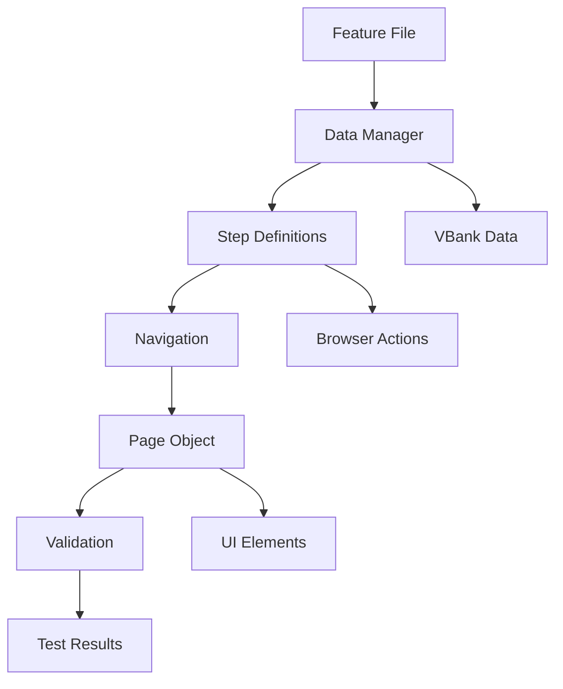
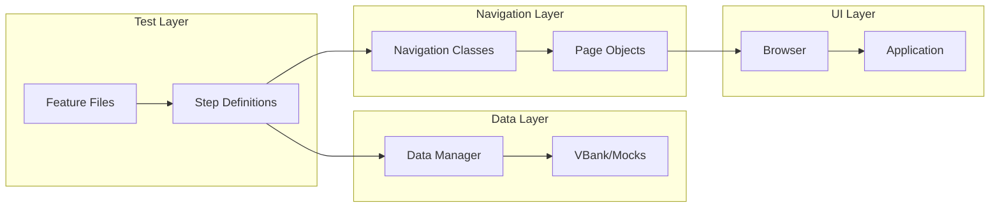

# 🧪 Tutorial: Creación Completa de Test E2E @MCI001

## 📋 Tabla de Contenidos

1. [Objetivo del Test](#-objetivo-del-test)
2. [Paso 1: Feature File](#-paso-1-feature-file)
3. [Paso 2: Data Manager](#-paso-2-data-manager)
4. [Paso 3: Step Definitions](#-paso-3-step-definitions)
5. [Paso 4: Navigation](#-paso-4-navigation)
6. [Paso 5: Page Object](#-paso-5-page-object)
7. [Paso 6: Validation Step](#-paso-6-validation-step)
8. [Flujo Completo de Ejecución](#-flujo-completo-de-ejecución)
9. [Resumen y Arquitectura](#-resumen-y-arquitectura)
10. [Guía de Debugging](#-guía-de-debugging)

---

## 🎯 Objetivo del Test

**¿Qué queremos probar?**
> "Verificar que cuando una tarjeta NO tiene alias, el campo de alias NO se muestre en el modal de 'Más información'"

**Casos de prueba:**
1. **Con alias**: Debe mostrar la fila "Alias: MI TARJETA FAVORITA"
2. **Sin alias**: NO debe mostrar la fila de alias

---

## 📝 Paso 1: Feature File

**¿Por qué empezamos aquí?**
- Es la **especificación** del test en lenguaje natural
- Define **QUÉ** queremos probar, no **CÓMO**
- Es **legible** por cualquier persona (QA, Dev, PO)

**Archivo:** `test/e2e/lib/features/epics/productDetail/orangeProductDetail/moreCardInformation.feature`

```gherkin
@moreCardInformation
Feature: MoreCardInformation

    @MCI001
    @MX
    @web @android @ios
    @web-done
    @vbank
    @smokeTest
    Scenario Outline: Access to more info - See "<cardType>" card detail "<alias>"
        Given a user with the following criteria
            | criteria        |
            | <cardType> card |
            | <alias>         |
        And the user accesses to the "<alias>" "<cardType>" card product detail
        When the user accesses to detail information card
        Then the user sees the following items in the screen
            | item                       | value      |
            | Card Image                 |            |
            | Card Number                |            |
            | Card Date                  |            |
            | Card Holder Name           |            |
            | Card Type Label            |            |
            | Card Type Value            |            |
            | Card Alias Label           | <visible>  |
            | Card Alias Value           | <visible>  |
            | Associate Products Label   |            |
            | Associate Products Value   |            |
            | Card Number Label          |            |
            | Card Number Value          |            |
            | Card Date Label            |            |
            | Card Date Value            |            |
            | Card Holder Label          |            |
            | Card Holder Value          |            |
            | Credit Limit Label         | <visible1> |
            | Credit Limit Value         | <visible1> |
            | Copy button                |            |
            | Annuity Label              | <visible1> |
            | Annuity Value              | <visible1> |
            | Collection Expenses Label  | <visible1> |
            | Collection Expenses Value  | <visible1> |
            | Replacement Label          | <visible1> |
            | Replacement Value          | <visible1> |
        @backend(artichoke)
        Examples:
            | alias         | visible     | cardType | visible1    |
            | with alias    | visible     | credit   | visible     |
            | with alias    | visible     | debit    | not visible |
            | without alias | not visible | credit   | visible     |
            | without alias | not visible | debit    | not visible |
```

### Explicación de cada parte:

```gherkin
@moreCardInformation  # ← TAG: Agrupa tests relacionados
Feature: MoreCardInformation  # ← DESCRIPCIÓN: Qué funcionalidad probamos

@MCI001  # ← TAG ÚNICO: Identificador del test específico
@MX @web @android @ios  # ← TAGS: Plataformas donde corre
@web-done @vbank @smokeTest  # ← TAGS: Estado, entorno, tipo de test

Scenario Outline:  # ← TIPO: Escenario con múltiples casos (vs Scenario = 1 caso)
```

**¿Por qué Scenario Outline?**
- Necesitamos probar 4 casos diferentes (2 tipos de alias × 2 tipos de tarjeta)
- Scenario Outline nos permite reutilizar el mismo flujo con datos diferentes

**Variables `<alias>`, `<cardType>`, `<visible>`:**
- Se llenan desde la tabla `Examples`
- `<alias>` → `"with alias"` o `"without alias"`
- `<cardType>` → `"credit"` o `"debit"`
- `<visible>` → `"visible"` o `"not visible"`

---

## 🗃️ Paso 2: Data Manager

**¿Por qué necesitamos Data Manager?**
- Los tests necesitan **datos reales** para funcionar
- "with alias" y "without alias" son **criterios**, no datos específicos
- Necesitamos **mapear** estos criterios a tarjetas reales en el vbank

### 2.1 Diccionario de Criterios

**Archivo:** `test/e2e/lib/features/support/data-manager/dictionaries/Users.js`

```javascript
// Diccionario de criterios que se usan en los features
const userCriteria = {
    // Criterios de alias
    'with alias': 'with_alias',
    'without alias': 'without_alias',
    
    // Criterios de tipo de tarjeta
    'credit card': 'credit_card',
    'debit card': 'debit_card',
    
    // Otros criterios...
    'operative': 'operative',
    'blocked': 'blocked',
};

export { userCriteria };
```

### 2.2 Función de Búsqueda de Datos

**Archivo:** `test/e2e/lib/features/step_definitions/productDetails/orangeCardProductDetails.js`

```javascript
// Diccionario para mapear criterios del feature a constantes
const dictionaryStatus = {
    'with alias': 'WITH_ALIAS',
    'without alias': 'WITHOUT_ALIAS',
    'credit': 'CREDIT_CARD',
    'debit': 'DEBIT_CARD',
    'operative': 'OPERATIVE',
    // ... más mapeos
};

/**
 * Función que busca una tarjeta en el vbank según los criterios
 * @param {string} cardStatus - Estado/criterio de la tarjeta ("with alias", "without alias")
 * @param {string} cardType - Tipo de tarjeta ("credit", "debit")
 * @returns {Object} - Datos de la tarjeta encontrada
 */
function getDataCard(cardStatus, cardType) {
    const cardStatusDictionary = dictionaryStatus[cardStatus.toLowerCase()];
    let cardProduct;

    if (cardType.toLowerCase() === 'credit') {
        switch (cardStatusDictionary) {
            case 'WITH_ALIAS':
                // Busca tarjeta de crédito OPERATIVA que SÍ tenga alias
                cardProduct = global.user.products.cards.find(element => 
                    element.cardType.id === 'CREDIT_CARD' && 
                    element.status.id === 'OPERATIVE' && 
                    element.alias !== undefined  // ← Tiene alias
                );
                break;
            case 'WITHOUT_ALIAS':
                // Busca tarjeta de crédito OPERATIVA que NO tenga alias
                cardProduct = global.user.products.cards.find(element => 
                    element.cardType.id === 'CREDIT_CARD' && 
                    element.status.id === 'OPERATIVE' && 
                    element.alias === undefined  // ← No tiene alias
                );
                break;
        }
    } else if (cardType.toLowerCase() === 'debit') {
        switch (cardStatusDictionary) {
            case 'WITH_ALIAS':
                cardProduct = global.user.products.cards.find(element => 
                    element.cardType.id === 'DEBIT_CARD' && 
                    element.status.id === 'OPERATIVE' && 
                    element.alias !== undefined
                );
                break;
            case 'WITHOUT_ALIAS':
                cardProduct = global.user.products.cards.find(element => 
                    element.cardType.id === 'DEBIT_CARD' && 
                    element.status.id === 'OPERATIVE' && 
                    element.alias === undefined
                );
                break;
        }
    }

    // Guarda la tarjeta seleccionada para usar en navegación
    if (cardProduct) {
        global.storage = global.storage || {};
        global.storage['selectedProduct'] = {
            cardId: cardProduct.id,
            cardType: cardProduct.cardType.id,
            alias: cardProduct.alias
        };
    }

    return cardProduct;
}

export { getDataCard };
```

**¿Por qué necesitamos esta función?**
- El feature dice "with alias" pero el vbank tiene datos reales
- Necesitamos **traducir** el criterio a una búsqueda real
- `global.storage` guarda la tarjeta seleccionada para usarla después

---

## 🔗 Paso 3: Step Definitions

**¿Por qué necesitamos Step Definitions?**
- Cucumber lee el feature pero no sabe **CÓMO** ejecutar cada paso
- Necesitamos **traducir** el texto del feature a código JavaScript

### 3.1 Step Definition para Data Manager

**Archivo:** `test/e2e/lib/features/step_definitions/common/data-manager.js`

```javascript
import { Given } from '@cucumber/cucumber';

/**
 * Función que obtiene datos del vbank según criterios
 * @param {Object} world - Contexto de Cucumber
 * @param {string} namespace - Tipo de datos ('user', 'account', etc.)
 * @param {Array} tags - Criterios de búsqueda
 * @returns {Object} - Datos encontrados
 */
async function getDMEntryData(world, namespace, tags) {
    // Aquí se conecta con el vbank/mock para obtener datos reales
    return (await world.dataManager.getSingleEntry({type: namespace(true), tags})).data;
}

/**
 * STEP DEFINITION: "Given a user with the following criteria"
 * 
 * Este step se ejecuta cuando Cucumber encuentra:
 * "Given a user with the following criteria"
 * 
 * @param {Object} datamanager - Objeto que maneja el tipo de datos
 * @param {Object} table - Tabla del feature con criterios
 */
Given('a(n) {datamanager} with the following criteria(:)', async function(datamanager, table) {
    // Extrae criterios de la tabla del feature
    const criteria = table.hashes().map(row => row.criteria);
    
    // Ejemplo: criteria = ["credit card", "with alias"]
    
    // Obtiene datos del vbank según los criterios
    global[datamanager.varname()] = await getDMEntryData(this, datamanager.namespace, criteria);
    
    // Guarda los criterios para debugging
    global[datamanager.varname()].__givenCriteria = criteria;
});

export { getDMEntryData };
```

### 3.2 Step Definitions para Navegación

**Archivo:** `test/e2e/lib/features/step_definitions/productDetails/orangeCardProductDetails.js`

```javascript
import { When } from '@cucumber/cucumber';
import { getDataCard } from './orangeCardProductDetails.js';
import * as navigation from '../navigation';

/**
 * STEP DEFINITION: "And the user accesses to the '<alias>' '<cardType>' card product detail"
 * 
 * Este step se ejecuta cuando Cucumber encuentra:
 * "And the user accesses to the "with alias" "credit" card product detail"
 * 
 * @param {string} cardStatus - "with alias" o "without alias"
 * @param {string} cardType - "credit" o "debit"
 */
When(/^the user accesses to the "([^"]*)" "([^"]*)" card product detail$/, async function(cardStatus, cardType) {
    // 1. Busca la tarjeta en el vbank según los criterios
    getDataCard(cardStatus, cardType);
    
    // 2. Navega al dashboard
    await navigation.dashboard.go();
    
    // 3. Abre el detalle de la tarjeta seleccionada
    await navigation.card.orangeCardProductDetail.go({
        card: global.storage['selectedProduct'].cardId
    });
    
    // 4. Cierra tooltips si aparecen
    await orangeCardProductDetail.closeTooltipDigitalCard();
});

/**
 * STEP DEFINITION: "When the user accesses to detail information card"
 * 
 * Este step se ejecuta cuando Cucumber encuentra:
 * "When the user accesses to detail information card"
 */
When(/^the user accesses to detail information card$/, async function() {
    // Navega al modal de "Más información"
    await navigation.card.moreInfoCardDetail.go();
});
```

**¿Por qué estos step definitions?**
- **Primer step**: Maneja la navegación inicial al detalle de tarjeta
- **Segundo step**: Maneja la apertura del modal de "Más información"
- Cada step tiene una **responsabilidad específica**

---

## 🧭 Paso 4: Navigation

**¿Por qué necesitamos Navigation?**
- Maneja el **flujo de navegación** entre páginas
- Encapsula la **lógica de navegación** reutilizable
- Permite **navegar desde cualquier página** a cualquier otra

**Archivo:** `test/e2e/lib/features/navigation/card/moreInfoCardDetail.js`

```javascript
import AbstractGlomoNavigation from '../abstract-glomo-navigation';
import { NotPathNavigationError } from '@csqe/radish';
import * as navigation from '../../navigation';

// Importa las páginas que vamos a usar
import startPage from '../../pages/start';
import orangeCardProductDetailPage from '../../pages/productDetails/orangeCardProductDetail';
import dashboardPage from '../../pages/dashboard/dashboard';

// IDs de las páginas
const START = startPage.getId();
const DASHBOARD = dashboardPage.getId();
const ORANGE_CARD_PRODUCT_DETAIL = orangeCardProductDetailPage.getId();

/**
 * Clase que maneja la navegación al modal de "Más información" de tarjeta
 * 
 * ¿Por qué existe esta clase?
 * - El test puede empezar desde diferentes páginas
 * - Necesitamos un camino válido desde cualquier punto
 * - Encapsula la lógica de navegación específica para este flujo
 */
class MoreInfoCardDetail extends AbstractGlomoNavigation {
    constructor() {
        super({
            page: 'card/moreInfoCardDetail', 
            parentNavigation: 'card/orangeCardProductDetail'  // ← Página padre
        });
    }

    /**
     * Implementa la navegación según la página actual
     * @param {Object} params - Parámetros de navegación (opcional)
     */
    async go_impl({ card } = {}) {
        const currentPage = getCurrentPage(); // Función que obtiene la página actual
        
        switch (currentPage.getId()) {
            case START:
            case DASHBOARD:
                // Si estamos en inicio o dashboard, primero vamos al detalle de tarjeta
                await navigation.card.orangeCardProductDetail.go({ card });
                await this.go_impl(); // ← Recursión para continuar desde el detalle
                break;
                
            case ORANGE_CARD_PRODUCT_DETAIL:
                // Si ya estamos en el detalle de tarjeta, abrimos el modal
                await orangeCardProductDetailPage.moreInfoCard();      // ← Click en "Más info"
                await orangeCardProductDetailPage.cardDetailInfo();   // ← Abre el modal
                break;
                
            default:
                throw new NotPathNavigationError();
        }
    }
}

export default new MoreInfoCardDetail();
```

**¿Por qué esta lógica de navegación?**
- **Flexibilidad**: El test puede ejecutarse desde cualquier página
- **Reutilización**: Otros tests pueden usar la misma navegación
- **Mantenimiento**: Si cambia el flujo, solo se modifica aquí

---

## 📄 Paso 5: Page Object

**¿Por qué necesitamos Page Object?**
- Define **dónde encontrar** cada elemento en la UI
- Encapsula la **lógica de interacción** con elementos
- Permite **reutilizar** selectores en diferentes tests

**Archivo:** `test/e2e/lib/features/pages/card/moreInfoCardDetail.js`

```javascript
import AbstractGlomoPage from '../abstract-glomo-page';
import { ScreenValidationKeyNotFound, page } from '@csqe/radish';
import config from '../../../config/base/config';

/**
 * Page Object para el modal de "Más información" de tarjeta
 * 
 * ¿Por qué existe esta clase?
 * - Define los selectores de elementos en el modal
 * - Encapsula la lógica de validación
 * - Permite reutilizar estos elementos en otros tests
 */
@page()
class MoreInfoCardDetail extends AbstractGlomoPage {
    constructor() {
        super({
            root: '#cells-template-cardDetail[state="active"]',  // ← Selector raíz del modal
            elements: {
                // Header del modal
                header: '.first-level-sequential .header #heading',
                
                // Información de la tarjeta (frente)
                frontCard: {
                    properties: { root: 'bbva-feature-product-detail-cards-mx' },
                    image: 'bbva-clip-card-data',
                    number: 'more-info bbva-clip-card-data .holder-number',
                    date: 'more-info bbva-clip-card-data .holder .time span',
                    holderName: 'more-info bbva-clip-card-data .holder-top bbva-type-text span',
                },
                
                // Campos del detalle
                cardType: {
                    properties: { root: '#item-productType' },  // ← ID generado por widget-card-more-info
                    label: 'bbva-type-text p',
                    value: 'bbva-type-text.align-right h5 span',
                },
                
                // ⭐ ELEMENTO CLAVE: Alias
                cardAlias: {
                    properties: { root: '#item-alias' },  // ← ID generado por widget-card-more-info
                    label: 'bbva-type-text p',            // ← Selector del label "Alias"
                    value: 'bbva-type-text.align-right h5 span'  // ← Selector del valor del alias
                },
                
                // Otros campos...
                associateProducts: {
                    properties: { root: '#item-product' },
                    label: 'bbva-type-text p',
                    value: 'bbva-type-text.align-right h5 span',
                },
                
                cardNumber: {
                    properties: { root: '#item-cardNumber' },
                    label: 'bbva-type-text p',
                    value: 'bbva-type-text.align-right h5 span',
                },
                
                // ... más elementos
            },
            requiredElements: [
                'header',
                'frontCard',
            ],
        });
    }

    /**
     * Valida elementos en la pantalla según el feature
     * @param {Object} params - {item, value, _args}
     */
    async _screenValidation({ item, value, _args } = {}) {
        const reverseWaitForDisplayed = value === 'not visible';
        
        switch (item.toLowerCase()) {
            case 'card image':
                await this.frontCard.image.waitForDisplayed({ timeout: config.wait.M });
                break;
                
            case 'card number':
                await this.frontCard.number.waitForDisplayed({ timeout: config.wait.M });
                break;
                
            case 'card alias label':
                // ⭐ VALIDACIÓN CLAVE DEL TEST
                await this.cardAlias.label.waitForDisplayed({
                    timeout: config.wait.M, 
                    reverse: reverseWaitForDisplayed  // ← Si value="not visible", reverse=true
                });
                break;
                
            case 'card alias value':
                // ⭐ VALIDACIÓN CLAVE DEL TEST
                await this.cardAlias.value.waitForDisplayed({
                    timeout: config.wait.M, 
                    reverse: reverseWaitForDisplayed
                });
                break;
                
            // ... más validaciones
                
            default:
                throw new ScreenValidationKeyNotFound(`Key not found: ${item}`);
        }
    }
}

export default new MoreInfoCardDetail();
```

**¿Por qué estos selectores específicos?**
- **`#item-alias`**: ID generado por el componente `widget-card-more-info.js` (línea 145)
- **`bbva-type-text p`**: Selector del label "Alias"
- **`bbva-type-text.align-right h5 span`**: Selector del valor del alias

---

## ✅ Paso 6: Validation Step

**Archivo:** `test/e2e/lib/features/step_definitions/common/validation.js`

```javascript
import { Then } from '@cucumber/cucumber';
import * as navigation from '../../navigation';

/**
 * STEP DEFINITION: "Then the user sees the following items in the screen"
 * 
 * Este step se ejecuta cuando Cucumber encuentra:
 * "Then the user sees the following items in the screen"
 * 
 * @param {Object} table - Tabla con elementos a validar del feature
 */
Then('the user sees the following items in the screen(:)', async function(table) {
    // Obtiene la página actual (MoreInfoCardDetail)
    const currentPage = navigation.getCurrentPage();
    
    // Llama al método de validación de la página
    await currentPage.validateScreen(table);
});

/**
 * STEP DEFINITION: "Then the user sees correctly updated 'new alias' alias account"
 * 
 * Ejemplo de otro tipo de validación más específica
 */
Then(/^the user sees correctly updated "([^"]*)" alias account$/, async function(alias) {
    const currentPage = navigation.getCurrentPage();
    
    // Valida que el alias se actualizó correctamente
    await currentPage.cardAlias.value.waitForText({ text: alias });
});
```

---

## 🔄 Flujo Completo de Ejecución

### Ejecución del Escenario: "without alias" + "credit"

```
1. FEATURE FILE
   "without alias" → <alias> = "without alias"
   "credit" → <cardType> = "credit"
   "not visible" → <visible> = "not visible"

2. DATA MANAGER
   getDataCard("without alias", "credit")
   → Busca tarjeta con alias === undefined
   → Encuentra: { id: "123", alias: undefined, cardType: "CREDIT_CARD" }

3. STEP DEFINITIONS
   Given: Carga datos del vbank
   And: Navega al detalle de tarjeta
   When: Abre modal "Más información"
   Then: Valida elementos

4. NAVIGATION
   moreInfoCardDetail.go()
   → Click en botón "Más información"
   → Abre modal

5. PAGE OBJECT
   cardAlias.label.waitForDisplayed({ reverse: true })
   → Busca elemento #item-alias
   → reverse: true → Espera que NO exista

6. COMPONENTE (widget-card-more-info.js)
   alias = undefined
   → delete _generalInformationListItems.alias
   → NO renderiza #item-alias

7. VALIDACIÓN
   Elemento #item-alias NO existe ✅
   Test PASA ✅
```

### Diagrama de Flujo



---

## 🎯 Resumen y Arquitectura

### ¿Por Qué Cada Pieza?

| Pieza | ¿Por qué existe? | ¿Qué hace? |
|-------|------------------|------------|
| **Feature File** | Especificación legible | Define QUÉ probar |
| **Data Manager** | Datos reales | Mapea criterios a datos del vbank |
| **Step Definitions** | Traducción a código | Define CÓMO ejecutar cada paso |
| **Navigation** | Flujo reutilizable | Maneja navegación entre páginas |
| **Page Object** | Selectores encapsulados | Define DÓNDE encontrar elementos |
| **Validation** | Verificación de resultados | Compara esperado vs real |

### Flujo de Dependencias:
```
Feature → Step Definitions → Page Objects
   ↓           ↓                ↓
Data Manager ← Navigation ← Validation
```

### Arquitectura Completa:



---

## 🔍 Guía de Debugging

### Para encontrar la conexión entre piezas:

#### 1. Feature → Step Definitions
```bash
# Buscar texto exacto del feature en step definitions
grep -r "user accesses to detail information card" test/e2e/lib/features/step_definitions/

# Resultado:
# test/e2e/lib/features/step_definitions/productDetails/orangeCardProductDetails.js:405
```

#### 2. Step Definitions → Feature
```bash
# Buscar el patrón regex en features
grep -r "user accesses to detail information card" test/e2e/lib/features/

# Resultado:
# test/e2e/lib/features/epics/productDetail/orangeProductDetail/moreCardInformation.feature:16
```

#### 3. Por Tags
```bash
# Buscar tag específico
grep -r "@MCI001" test/e2e/lib/features/

# Resultado:
# test/e2e/lib/features/epics/productDetail/orangeProductDetail/moreCardInformation.feature:4
```

#### 4. Ejecutar Test Específico
```bash
# Navegar al directorio de e2e
cd test/e2e

# Ejecutar solo el test @MCI001
npm run test:vbank -- --tags "@MCI001"

# Ejecutar con configuración específica
npm run test:vbank -- --tags "@MCI001" --config config/vbank/vbankWeb.js
```

### Métodos de Debugging:

1. **Por texto exacto**: Busca el texto del feature en step_definitions
2. **Por patrón regex**: Busca el patrón del step definition en features
3. **Por tags**: Usa `@MCI001` para encontrar todos los archivos relacionados
4. **Por funcionalidad**: Busca por palabras clave como "alias", "card", etc.

---

## 🚀 Comandos Útiles

### Ejecutar Tests:
```bash
# Ejecutar test específico
npm run test:vbank -- --tags "@MCI001"

# Ejecutar todos los tests de un feature
npm run test:vbank -- --tags "@moreCardInformation"

# Ejecutar con modo debug
npm run test:vbank -- --tags "@MCI001" --debug

# Ejecutar solo en web
npm run test:vbank -- --tags "@MCI001 and @web"
```

### Generar Reportes:
```bash
# Generar reporte HTML
npm run test:vbank -- --tags "@MCI001" --format html:reports/cucumber-report.html

# Generar reporte JSON
npm run test:vbank -- --tags "@MCI001" --format json:reports/cucumber-report.json
```

---

## 📚 Conceptos Clave

### Gherkin/Cucumber:
- **Feature**: Descripción de funcionalidad
- **Scenario**: Un caso de prueba específico
- **Scenario Outline**: Múltiples casos con datos variables
- **Given/When/Then**: Estructura de los pasos
- **Examples**: Datos para variables en Scenario Outline

### Arquitectura E2E:
- **Page Object Pattern**: Encapsula selectores y acciones
- **Data-Driven Testing**: Tests con datos externos
- **Separation of Concerns**: Cada pieza tiene una responsabilidad
- **Reusability**: Componentes reutilizables entre tests

### Debugging:
- **Traceability**: Seguir el flujo desde feature hasta UI
- **Isolation**: Aislar problemas por capas
- **Logging**: Usar logs para entender el flujo
- **Screenshots**: Capturar estado en caso de fallos

---

## 🎉 Conclusión

Este tutorial muestra cómo crear un test E2E completo desde cero, explicando cada pieza y su propósito. La arquitectura modular permite:

- **Mantenibilidad**: Cambios en una pieza no afectan otras
- **Reutilización**: Componentes se pueden usar en otros tests
- **Escalabilidad**: Fácil agregar nuevos tests siguiendo la misma estructura
- **Debugging**: Fácil identificar problemas por capas

El test @MCI001 es un ejemplo perfecto de cómo verificar comportamiento condicional en la UI usando datos reales del vbank y validaciones específicas.

---

*Documento creado para tutorial de funcionamiento de tests E2E en glomo-mx*
